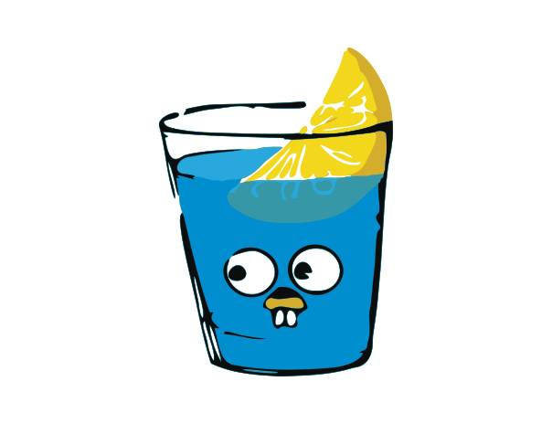

<h1 align = "center"> Hello! I'm Hugo Vallada </h1>

 

## About Me

 - I'm a backend developer from Brazil.
 - 🏢 I'm currently working at [Zup IT Innovation](https://www.zup.com.br/)
 - Working experience:
      - Programming Languages: Kotlin, Java and Python.
      - Frameworks: Spring, Micronaut
      - Cloud: AWS (Lambda, Kms, Secret Manager, ECS Fargate, DynamoDB, API Gateway, ELB, S3, Code Pipeline...)
      - Devops: Terraform, Github Actions, Cloudformation
      - Containers: Docker
      - Observability: X-Ray, CloudWatch, Splunk, AppDynamics
 

<a href="https://github.com/hugovallada">

  
   

  ## Technologies that i'm currently working with:
  

    
    
    
    
    
    
    
    
    
  

  ## Technologies that I enjoy and that you may find here:
  

    
    
    
    
    
    
    
    
    
    

  

  
   
  
  
 ##  📝 Medium

  
<a target="_blank" href="https://github-readme-medium-recent-article.vercel.app/medium/@valladahugo/0"> 

  
 

  ## Contact me:

<a target="_blank" href="https://www.linkedin.com/in/hugo-vallada/">

<!---->

