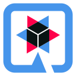
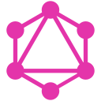

<h1 align = "center"> Hello! I'm Hugo Vallada </h1>
<h1 align = "center"> Welcome!! </h3>

 

## About Me

 - I'm a backend developer from Brazil.
 - 🏢 I'm currently working at [Zup IT Innovation](https://www.zup.com.br/)
 - Primarly working with cloud development using Kotlin/Java on AWS. Alson experienced with Python, Docker.
 

<a href="https://github.com/hugovallada">

  
   

  ## Technologies that i'm currently working with:
  

    
    
    
    
    
    
    
    
    
  

  ## Technologies that I enjoy and that you may find here:
  

    
    
    
    
    
    
    

  

  
   
  
  
 ##  📝 Medium

  
<a target="_blank" href="https://github-readme-medium-recent-article.vercel.app/medium/@valladahugo/0"> 

  
 

  ## Contact me:

<a target="_blank" href="https://www.linkedin.com/in/hugo-vallada/">

<!---->

<!--
**hugovallada/hugovallada** is a ✨ _special_ ✨ repository because its `README.md` (this file) appears on your GitHub profile.

Here are some ideas to get you started:

- 🔭 I’m currently working on ...
- 🌱 I’m currently learning ...
- 👯 I’m looking to collaborate on ...
- 🤔 I’m looking for help with ...
- 💬 Ask me about ...
- 📫 How to reach me: ...
- 😄 Pronouns: ...
- ⚡ Fun fact: ...
-->
